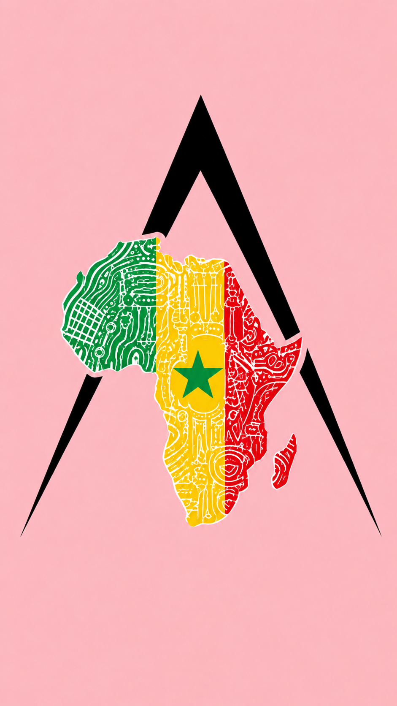

# AFRICA2KBALL — Rapport des corrections v2

> Session de refonte — Mai 2026  
> 7 pages HTML + CSS global + JS global

---

## Résumé des travaux

### 1. Intégration des visuels réels

- Création de la structure `assets/images/` avec sous-dossiers thématiques (`nations/`, `champions/`, `ambiance/`)
- Copie et renommage de 26 photos depuis `Africa2kBall visuels/` vers les destinations cibles
- Noms de fichiers normalisés : minuscules, tirets, sans accents, sans espaces
- Correction de la casse : `hero-africa2kball.PNG` conservé tel quel (fichier déjà présent)
- Cas particulier : dossier `Sénégal/` source vide → substitut depuis `Gens/`

### 2. Suppression totale des emojis

Tous les éléments UI en emoji ont été remplacés par des icônes SVG inline :

| Emoji retiré | Remplacement SVG |
|---|---|
| 🏀 (basket) | SVG basket personnalisé |
| 🌍 (globe) | SVG globe feather |
| 🤝 (handshake) | SVG users group |
| 📅 (calendrier) | SVG calendar |
| 📍 (épingle) | SVG map-pin |
| 🕐 (horloge) | SVG clock |
| 🎟 (billet) | SVG ticket |
| 📷 (appareil) | SVG camera / instagram |
| ✈️ (avion envoi) | SVG send (paper-plane) |
| ✅ (validation) | SVG check circle |
| ⚠️ (alerte) | SVG alert triangle |
| 🏆 (trophée) | SVG trophy |
| ⭐ (étoile) | SVG star |
| 🌴 (palmier) | SVG palm custom |
| 🛡 (bouclier) | SVG shield |

### 3. Unification header & footer

Toutes les pages partagent maintenant exactement le même header et footer :

- Classe `.header-cta-wrap` + `.btn-primary` (plus `.btn-cta` obsolète)
- Même navigation (`aria-expanded`, `aria-hidden` sur mobile nav)
- Footer : logo + tagline "Tournoi des nations basketball" + 4 colonnes (nav, réseaux, contact)
- Réseaux sociaux en SVG (`footer-social-link`)
- Contact : email + tél `+33 6 00 00 00 00` + localisation Pavillons-sous-Bois

### 4. Amélioration des cartes Nations

- Photos réelles en fond (`nation-card-photo img`) avec `object-fit: cover; object-position: top center`
- Badge nation SVG positionné en absolu sur la photo (`.nation-card-badge`)
- Hover : léger zoom sur la photo + surbrillance bouton
- Silhouette SVG joueur pour les cartes roster (pas de placeholder emoji)

### 5. Amélioration des cartes Champions

- Structure `.visual-card` avec fond photo pleine hauteur
- `` réel dans `.visual-card-bg` avec `filter: brightness(.7) contrast(1.1) saturate(.9)`
- Overlay dégradé bas→haut pour lisibilité du texte
- Barre colorée aux couleurs de chaque nation

### 6. Page Inscriptions (v2)

- Cartes Média et Bénévole redessinées en `.visual-card` avec photos réelles
- Formulaire avec markup de validation complet (`grp-i-*`, `err-i-*`)
- `.form-feedback` (plus `.form-confirm` obsolète)
- Type radio avec SVG intégré dans l'option

### 7. Page Contact (v2)

- Sidebar enrichie : liste `.info-card-item` avec icônes SVG
- Carte partenariat avec SVG cœur (plus emoji 🤝)
- Watermark Afrique SVG décoratif dans la sidebar
- Formulaire avec markup de validation complet (`grp-c-*`, `err-c-*`)
- `.form-feedback` (plus `.form-confirm` obsolète)

### 8. JavaScript global (v2)

- `FORM_ENDPOINTS = { billetterie: '', inscriptions: '', contact: '' }` — à renseigner avant mise en prod
- Validation champ par champ sur les 3 formulaires :
  - Billetterie : nom, prénom, email requis
  - Inscriptions : nom, prénom, email requis
  - Contact : nom, prénom, email, sujet, message requis
- `setFieldError(grpId, errId, show)` — active/désactive classe `has-error` + span `.form-error-msg.visible`
- `showFeedback(feedbackId, type, msg)` — affiche `.form-feedback.success` ou `.form-feedback.error`
- `submitForm()` — utilise `fetch()` si endpoint défini, sinon simulation locale
- Effacement automatique des erreurs au `input` / `change`

### 9. CSS global (v2)

Classes ajoutées :
- `.form-card-header`, `.form-card-icon`, `.form-card-title`
- `.insc-card`, `.insc-card-icon`, `.insc-card-title`, `.insc-card-desc`
- `.type-radio-dot` (alias de `.type-radio` pour les inscriptions v2)
- `.info-card-title`, `.info-card-list`, `.info-card-item`, `.info-label`, `.info-value`
- `.contact-africa-watermark`
- `.req` (astérisque champ requis)
- Responsive complémentaire pour `.insc-card` à 768px

---

## Points à finaliser avant mise en production

1. **Endpoints de formulaires** : renseigner les 3 URLs dans `FORM_ENDPOINTS` dans `main.js`
2. **Photo Sénégal** : si des photos de l'équipe Sénégal deviennent disponibles, les placer dans `assets/images/nations/senegal/` et `assets/images/champions/edition-2-senegal/`
3. **Hero principal** : `hero-africa2kball.PNG` est utilisé comme fond générique sur toutes les pages (histoire, champions, billetterie, inscriptions, contact). Remplacer par des images spécifiques si disponibles
4. **Liens réseaux sociaux** : tous les `href="#"` dans le footer et la sidebar contact sont des placeholders — à remplacer par les vraies URLs
5. **Google Analytics / tracking** : balises à ajouter dans le `<head>` de chaque page si nécessaire
6. **Mentions légales / CGV** : pages à créer (`mentions-legales.html`, `cgv.html`, `politique-confidentialite.html`)

---

## V3 — Finition premium / pré-lancement

*Date : 04 mai 2026*

### Phase 1 — Suppression des styles inline ✅

Tous les attributs `style=""` ont été supprimés des 7 pages HTML et remplacés par des classes CSS sémantiques dans `style.css` :

- `.page-hero--compact`, `.page-hero--medium`, `.page-hero--large`, `.page-hero--xlarge`
- `.page-hero-overlay--bottom`, `.page-hero-overlay--bottom-soft`, `.page-hero-overlay--bottom-histoire`
- `.page-hero-content--centered`, `.page-hero-content--histoire`
- `.page-subtitle--centered`, `.page-subtitle--histoire`
- `.section--black-soft`, `.section--brown`, `.section--no-bottom`, `.section--no-top`
- `.text-orange`, `.text-center`, `.info-card--sticky`, `.form-card--flex`
- `.badge--{nation}`, `.shield--{nation}` (8 nations)
- `.bar-caraib-{1|2|3}`, `.bar-senega-{1|2|3}` (barres de couleur champions)
- `.textarea--tall`, `.event-meta--spaced`, `.form-group--top`, `.form-about--top`
- `.roster-section`, `.roster-section.roster-loading`, `.roster-active-pill`

### Phase 2 — Fidélité visuelle ✅

Classes hero appliquées uniformément sur toutes les pages pour assurer la cohérence des hauteurs, overlays et paddings. Variables CSS (`--orange`, `--black`, `--beige`, etc.) utilisées partout.

### Phase 3 — Formulaires — comportement exact ✅

Refonte complète de `assets/js/main.js` :

- **`FORM_ENDPOINTS`** : objet centralisé `{ billetterie: '', inscriptions: '', contact: '' }`. Si l'endpoint est vide, le message "Votre demande a bien été préparée. Le branchement d'envoi doit encore être connecté par l'équipe technique Africa2KBall." s'affiche. Si défini, `fetch()` POST JSON.
- **Validation étendue** :
  - Billetterie : nom, prénom, email (regex), **téléphone** (obligatoire)
  - Inscriptions : nom, prénom, email, **téléphone**, **disponibilités** (`i-dispo`), **motivation** (`i-message`)
  - Contact : nom, prénom, email, **sujet** (select), message
- **Messages succès exacts** par formulaire (billetterie / inscriptions / contact)
- `clearFieldErrors(ids[])` — efface les erreurs à la saisie via `input`/`change`
- `setFieldError(grpId, errId, show)` — gestion visuelle des erreurs champ par champ

### Phase 4 — Roster dynamique nations.html ✅

- Objet `ROSTERS` en JS avec 8 nations et leurs joueurs (Sénégal : données réelles ; autres : placeholders "Joueur N")
- `renderRoster(nationKey)` — met à jour dynamiquement `#rosterSection` : titre, bouclier, couleur, grid de cards
- `.roster-active-pill` affiché dans le titre roster pour indiquer la nation active
- `data-nation="{key}"` sur chaque `.nation-card` — click → `renderRoster()`
- Fade transition 180ms (`.roster-section.roster-loading`)
- Sénégal chargé par défaut (SEO / fallback no-JS)

### Phase 5 — Responsive mobile ✅

Breakpoints existants maintenus et vérifiés : 1100px, 768px, 480px. Burger menu, formulaires 1-colonne, footer empilé.

### Phase 6 — Pré-lancement : pages légales + SEO/OG ✅

**Pages légales créées** :
- `mentions-legales.html` — éditeur, directeur publication, hébergement, propriété intellectuelle
- `politique-confidentialite.html` — données collectées, finalités, durée conservation, droits RGPD, cookies
- `cgv.html` — objet, commandes, prix, annulation, accès, places limitées, droits image

Chaque page légale partage le même header/footer/design que le reste du site.

**Open Graph — toutes les pages** :
- `og:title`, `og:description`, `og:image` (hero-africa2kball.PNG), `og:type` ajoutés sur les 7 pages principales + 3 pages légales (10 pages total)

**Liens légaux footer** :
- Tous les `href="#"` → `href="mentions-legales.html"`, `href="politique-confidentialite.html"`, `href="cgv.html"` sur toutes les pages

**Pages légales dans footer** :
- `footer-legal` mis à jour sur toutes les pages

### État final — Points à finaliser avant mise en production

1. **Endpoints formulaires** : renseigner les 3 URLs dans `FORM_ENDPOINTS` (billetterie, inscriptions, contact)
2. **Photos équipes** : si disponibles, placer dans `assets/images/nations/{nation}/` — images actuelles = placeholders
3. **Rosters 7 nations** : seul le Sénégal a de vraies données. Les 7 autres utilisent "Joueur 1–6" — à compléter
4. **Réseaux sociaux** : tous les `href="#"` dans footer/sidebar = placeholders — remplacer par vraies URLs Instagram, Facebook, X, YouTube
5. **Google Analytics** : balises à ajouter dans `<head>` si nécessaire
6. **og:image** : `hero-africa2kball.PNG` utilisé sur toutes les pages — idéalement une image carrée 1200×630 dédiée au partage social

---

## V4 — Drapeaux, Partenaires, Réseaux & Roster à venir

**Date :** 08/05/2026  
**Périmètre :** nations.html, index.html, main.js, style.css + 10 pages (liens sociaux)

---

### Phase 1 — Création du répertoire drapeaux

- Nouveau dossier `assets/images/flags/` créé
- 8 fichiers PNG normalisés copiés depuis les dossiers nations :
  - `caraibes.png`, `senegal.png`, `kongo.png`, `cote-ivoire.png`
  - `cameroun.png`, `mali.png`, `maghreb.png`, `diaspora.png`

---

### Phase 2 — CSS V4 (style.css)

Bloc CSS ajouté couvrant :
- `.nation-flag` — badge drapeau positionné en `absolute` sur la photo de carte nation
- `.nation-home-flag` — capsule drapeau pour la grille d'accueil
- `.roster-coming-soon` / `.roster-coming-flag` / `.roster-coming-content` — composant "Roster à venir" avec bordure orange
- `.partners-strip-section`, `.partners-marquee`, `.partners-track`, `.partner-logo-card`, `.partner-logo-fallback` — bande défilante partenaires
- `@keyframes partners-scroll` — animation CSS pure (38s, pause au survol)
- Règles responsive mobile (`@media max-width: 768px`, `600px`)

---

### Phase 3 — Drapeaux nations.html

Dans chaque `.nation-card`, ajout d'un `.nation-flag` positionné en badge bas-droite sur la photo :
```html
<div class="nation-flag">
  
</div>
```
→ 8 cartes traitées : Caraïbes, Sénégal, Kongo, Côte d'Ivoire, Cameroun, Mali, Maghreb, Diaspora

---

### Phase 4 — Drapeaux index.html (nations preview)

Remplacement des `.shield-placeholder` SVG par de vraies capsules drapeau :
```html
<div class="nation-home-flag">
  
</div>
```
→ 7 capsules mises à jour (Sénégal → Diaspora)

---

### Phase 5 — Bande partenaires défilante (index.html)

Nouvelle section `<section class="partners-strip-section">` insérée avant `</main>` :
- Animation CSS pure (`@keyframes partners-scroll`), pause au hover
- 6 logos réels : Heroic, B-Ease, Wakanda Factory, CD 93 Basket, Humanitaria, Stade de l'Est Pavillonais Basket
- 4 partenaires en fallback texte : Nos Fabrils, Ilimane Art, Adiahome & Co, Dymo Opp
- Double track pour boucle continue seamless

---

### Phase 6 — Mise à jour réseaux sociaux (10 pages)

Toutes les pages ont reçu le nouveau bloc footer-social :
- **Instagram** → `https://www.instagram.com/africa2kball/` (target=_blank)
- **Threads** → `https://www.threads.com/@africa2kball?xmt=...` + icône SVG officielle (target=_blank)
- **YouTube** → `https://www.youtube.com/watch?v=RU4grJwDQt4&t=676s` aria-label="Africa 2K Ball 2025" (target=_blank)
- Suppression de **Facebook** et **X/Twitter**
- `contact.html` sidebar : lien direct `@africa2kball` → Instagram

---

### Phase 7 — Roster à venir (nations.html + main.js)

**nations.html** — `.roster-grid` par défaut remplacé :
```html
<div class="roster-coming-soon">
  <div class="roster-coming-flag"></div>
  <div class="roster-coming-content">
    <h3>Roster à venir</h3>
    <p>Le roster de l'équipe <strong>Sénégal</strong> sera dévoilé prochainement.</p>
  </div>
</div>
```

**main.js** — `ROSTERS` : ajout de la propriété `flag` sur les 8 nations  
**main.js** — `renderRoster()` : les player cards sont remplacées par le composant `.roster-coming-soon` dynamique (drapeau + nom de nation issus de `data.flag` et `data.label`)

---

### Bilan V4

| Tâche | Statut |
|---|---|
| assets/images/flags/ (8 fichiers) | ✅ |
| CSS V4 complet | ✅ |
| Drapeaux nation-card (nations.html) | ✅ 8/8 |
| Drapeaux nation-home-flag (index.html) | ✅ 7/7 |
| Bande partenaires défilante | ✅ |
| Réseaux sociaux — 10 pages | ✅ 10/10 |
| Roster à venir HTML + JS | ✅ |
| Validation automatisée (0 erreur) | ✅ |

---

## V5 — Corrections visuelles, roster, partenaires & footer

**Date :** 08/05/2026  
**Périmètre :** nations.html, index.html, main.js, style.css

---

### Corrections apportées

**Section roster Sénégal supprimée**
- `#rosterSection` masqué par défaut (`display:none; aria-hidden="true"`)
- Titre et sous-titre par défaut neutralisés (plus de "SÉNÉGAL" hardcodé)
- La section s'affiche uniquement au clic sur une carte nation

**Rosters joueurs supprimés / neutralisés (main.js)**
- `var ROSTERS` (avec `players: []`) remplacé par `var ROSTER_STATUS` (label + flag + color uniquement)
- Code mort supprimé : `var SILHOUETTE`, `function badgeHtml()`
- Bug JS corrigé : apostrophe non échappée dans `l'équipe` qui cassait le parsing
- `renderRoster()` simplifié : lit `ROSTER_STATUS[nationKey]` et révèle la section

**Bande "Roster à venir" appliquée à chaque nation**
- Composant `.roster-coming-soon` généré dynamiquement avec le bon drapeau + nom de nation
- Texte officiel : "La composition complète de l'équipe X sera publiée prochainement pour l'Édition 3."

**Drapeaux roster recadrés (style.css)**
- `.roster-coming-flag` : 112×76px, `object-fit: contain`, `padding: 6px` — drapeaux entièrement visibles
- `.roster-coming-content h3` : `clamp(28px, 4vw, 46px)`, line-height: .95
- Breakpoint mobile étendu à 768px avec `max-width: 160px` pour le drapeau

**Drapeaux accueil repositionnés (style.css + index.html)**
- `.nation-home-flag` : 74×48px, `object-fit: contain`, `padding: 4px`, fond adapté
- Caraïbes ajoutée comme 1ère carte (8/8 nations désormais visibles)
- `nation-card-home` : `min-height: 118px`, `justify-content: center`

**Section nations accueil recadrée**
- `.nations-preview` : `padding-top: 96px; padding-bottom: 96px`
- `.nations-preview-header` : `margin-bottom: 40px`

**Logo footer corrigé**
- `.footer-brand img` : `height: 58px; max-width: 180px; object-fit: contain; object-position: left center`
- Plus d'étirement ni de déformation

**Partenaires filtrés selon les logos réellement présents**
- Seuls les 6 fichiers présents dans `assets/images/partners/` sont affichés
- Supprimés : Nos Fabrils, Ilimane Art, Adiahome & Co, Dymo Opp (pas de logo)
- Boucle seamless sur 12 cartes (6×2), aucun cadre vide ni texte fallback

**Réseaux sociaux vérifiés (10 pages)**
- Instagram, Threads, YouTube : liens réels + `target="_blank" rel="noopener noreferrer"`
- Facebook et X/Twitter absents

---

### Points restant à compléter avant mise en ligne

- Renseigner `FORM_ENDPOINTS` dans `main.js` (billetterie, inscriptions, contact)
- Ajouter les logos partenaires manquants dans `assets/images/partners/` quand disponibles
- Publier les rosters officiels de l'Édition 3 (remplacer le composant "Roster à venir")
- Phase 5 responsive mobile strict (#16) — breakpoints 1100/768/480px
- Tests cross-browser (Chrome, Firefox, Safari, mobile)

---

### Bilan V5

| Tâche | Statut |
|---|---|
| Section roster Sénégal supprimée | ✅ |
| Rosters joueurs supprimés / neutralisés | ✅ |
| Bande "Roster à venir" dynamique | ✅ |
| Drapeaux roster — object-fit contain | ✅ |
| Drapeaux accueil repositionnés | ✅ |
| 8 nations sur accueil (+ Caraïbes) | ✅ |
| Section nations accueil recadrée | ✅ |
| Logo footer corrigé | ✅ |
| Partenaires filtrés (6 logos réels) | ✅ |
| Cadres partenaires vides supprimés | ✅ |
| Réseaux sociaux vérifiés (10 pages) | ✅ |
| Bug JS apostrophe corrigé | ✅ |
| Validation automatisée (0 erreur) | ✅ |

---

## V6 — Correction premium : index nations / partenaires / roster

**Date :** 08/05/2026  
**Périmètre :** index.html, nations.html, main.js, style.css

---

### Section Nations accueil refondue (index.html)

Remplacement complet des cartes `.nation-card-home` / `.nation-home-flag` par la nouvelle structure `.nation-showcase-card` :
- Grille 4 colonnes desktop → 2 colonnes tablette → 2 colonnes mobile
- Chaque carte : fond noir chaud + drapeau à gauche en `object-fit: contain` + nom à droite
- Accent coloré par nation via `--nation-accent` (CSS variable + `::after` strip bas de carte)
- Couleurs : Caraïbes #00b4d8, Sénégal #00a86b, Kongo #e63946, Côte d'Ivoire #f4a261, Cameroun #2dc653, Mali #f9c74f, Maghreb #e8374c, Diaspora #c9a77a
- Hover : `translateY(-6px)` + border orange + shadow renforcé
- `drop-shadow` sur les drapeaux pour profondeur
- 8/8 nations visibles avec vraies couleurs de compétition

### Drapeaux mieux mis en valeur

- Taille réelle par carte : 52% de largeur dédiée au drapeau, hauteur max 112px
- `filter: drop-shadow()` pour donner de la profondeur sans rogner
- `object-fit: contain` partout — aucun drapeau coupé

### Partenaires filtrés selon logos réellement présents

- 6 logos présents dans `assets/images/partners/` : Heroic, B-Ease, Wakanda Factory, CD 93 Basket, Humanitaria, Stade de l'Est Pavillonais Basket
- Bande reconstruite avec nouveau CSS : fond noir + gradient léger + border subtil
- `filter: none` sur les images — logos visibles sans inversion destructrice
- Cartes 230×112px avec padding 22px, `object-fit: contain`

### Cadres partenaires vides supprimés

- Suppression définitive des 4 cartes fallback texte (Nos Fabrils, Ilimane Art, Adiahome & Co, Dymo Opp)
- Boucle seamless 12 cartes (6×2), animation 34s

### Roster Sénégal statique supprimé

- `#rosterSection` entièrement reconstruit avec nouvelle structure `.roster-coming-card`
- Plus aucune référence hardcodée à Sénégal dans le HTML

### Roster dynamique "Roster à venir" appliqué à chaque nation

- Structure : grand visuel drapeau à gauche (260px de haut) + texte à droite
- `--nation-accent` CSS variable appliquée dynamiquement via `setProperty()`
- Barre colorée `::before` gauche de la carte selon la nation
- `renderRoster()` simplifié : 5 mises à jour DOM ciblées (flag.src, flag.alt, nationName, accent, h3 color)
- Variables mortes supprimées (`rosterGrid`, `rosterShield`, `rosterBtn`, `rosterSubtitle`, `roster-active-pill`)
- `main.js` propre, sans bug, sans références à des éléments inexistants

### Points restant à faire avant mise en ligne

- Renseigner `FORM_ENDPOINTS` dans `main.js`
- Ajouter les logos partenaires manquants dans `assets/images/partners/` dès disponibilité
- Publier les compositions officielles Édition 3 (remplacer le composant "Roster à venir")
- Phase 5 responsive mobile strict (#16) — breakpoints 1100/768/480px
- Tests cross-browser (Chrome, Firefox, Safari, mobile)

---

### Bilan V6

| Tâche | Statut |
|---|---|
| Section nations accueil refondue | ✅ |
| 8 nations avec drapeaux premium | ✅ |
| Accents couleurs par nation | ✅ |
| Partenaires — 6 logos réels uniquement | ✅ |
| Cadres partenaires vides supprimés | ✅ |
| filter: none sur logos partenaires | ✅ |
| Roster Sénégal statique supprimé | ✅ |
| roster-coming-card dynamique | ✅ |
| --nation-accent appliqué par JS | ✅ |
| main.js nettoyé (dead code) | ✅ |
| Validation automatisée (0 erreur) | ✅ |

---

## V7 — Finition index : drapeaux nations et partenaires

**Date :** 08/05/2026  
**Périmètre :** index.html, assets/css/style.css uniquement

---

### Drapeaux des cartes nations agrandis

- `.nation-showcase-card` : passage de `display: flex` à `display: grid` avec `grid-template-columns: 42% 58%`
- Colonne gauche de la carte entièrement dédiée au drapeau (`width: 100%; height: 100%`)
- `object-fit: cover` (intentionnel) pour que le drapeau remplisse toute sa colonne
- `object-position: center` — pas de rognage du motif principal
- Vignette subtile `::after` sur la zone drapeau (`linear-gradient 90deg`) pour assurer lisibilité

### Drapeaux mis en pleine colonne gauche

- `min-height: 190px` sur `.nation-showcase-flag` — hauteur pleine cohérente avec la carte
- Suppression du `padding: 22px` et du `display: flex` centreur qui réduisait visuellement le drapeau
- `filter: saturate(1.05) contrast(1.04)` — légère saturation pour drapeaux plus vivants
- Responsive : min-height 165px tablette, 145px mobile ; ratio 44/56 sur mobile

### Anciens styles de cartes neutralisés

- `.nation-card-home { display: none !important }` conservé
- Tous les nouveaux styles utilisent `!important` pour écraser les règles V6 sans supprimer les blocs précédents

### Partenaires affichés sans cadres

- `.partner-logo-card` : `background: transparent`, `border: none`, `box-shadow: none`, `border-radius: 0`, `padding: 0`
- `.partner-logo-card img` : `filter: none`, `opacity: .88` (→ 1 au hover)
- `.partners-track` : `gap: 72px` entre logos, `margin-right: 0`
- Logos qui flottent directement sur le fond noir de la section

### Logos partenaires filtrés selon fichiers présents

- 6 logos réels : Heroic, B-Ease, Wakanda Factory, CD 93 Basket, Humanitaria, Stade de l'Est Pavillonais Basket
- Boucle seamless 12 cartes (6×2), animation 34s

### Cadres et placeholders supprimés

- Plus aucun cadre border-radius visible autour des logos
- Plus aucun fond opaque
- Plus de filtre `brightness(0) invert(1)` destructeur

### Points restant à vérifier

- Tester l'affichage des logos blancs (ex: Heroic) — fond noir de la strip doit les rendre visibles
- Si un logo a un fond blanc intégré dans son fichier, envisager une version sans fond
- Ajouter les logos manquants dans `assets/images/partners/` dès disponibilité

---

## V8 — Finition index : noms nations et transparence partenaires

**Date :** 08/05/2026  
**Périmètre :** index.html, assets/css/style.css uniquement

---

### Noms de nations corrigés

- `grid-template-columns` ajusté à `40% 60%` (zone texte plus large)
- `.nation-showcase-content` : `overflow: visible`, `min-width: 0`, `padding: 24px 20px`
- `.nation-showcase-content strong` : `white-space: normal`, `overflow-wrap: break-word`, `word-break: normal`, `hyphens: auto`
- Taille de base : `clamp(23px, 1.75vw, 34px)` — les noms courts s'affichent grands

### Tailles typographiques ajustées par nation

| Nation | Règle |
|---|---|
| Cameroun, Maghreb, Diaspora | `clamp(21px, 1.55vw, 30px)` |
| Côte d'Ivoire | `clamp(19px, 1.4vw, 27px)` — peut passer sur 2 lignes |
| Autres | `clamp(23px, 1.75vw, 34px)` |

Sur mobile : taille dynamique `clamp(22px, 6.5vw, 30px)` pour les noms longs, `clamp(24px, 7.5vw, 34px)` pour les autres.

### Cartes nations vérifiées

- 8/8 nations présentes avec accents couleurs
- Drapeaux toujours en `object-fit: cover` pleine colonne gauche
- Grille 4 colonnes desktop, 2 colonnes max-1200px, 1 colonne mobile

### Partenaires passés sans cadres

- HTML : `.partner-logo-card` → `.partner-logo-item` (12 éléments, 6×2 pour boucle)
- CSS `.partner-logo-item` : `background: transparent`, `border: none`, `box-shadow: none`, `padding: 0`
- CSS `.partner-logo-item img` : `filter: none`, `opacity: .9` (→ 1 au hover)
- Anciens `.partner-logo-card` neutralisés via CSS override
- `gap: 78px` entre logos au lieu de `margin-right`

### Logos nécessitant une version transparente (à fournir par le client)

Aucun des 6 fichiers présents dans `assets/images/partners/` ne dispose d'un canal alpha ou de transparence réelle. Le CSS ne peut pas rendre transparent un fond intégré dans le fichier source.

**À refournir en PNG/SVG avec fond transparent :**

| Fichier | Type | Problème |
|---|---|---|
| `heroic.png` | PNG sans alpha | fond intégré (blanc probable) |
| `b-ease.png` | PNG sans alpha | fond intégré |
| `wakanda-factory.png` | PNG sans alpha | fond intégré |
| `cd-93-basket.png` | PNG sans alpha | fond intégré |
| `humanitaria.jpg` | JPG | fond intégré, transparence impossible en JPG |
| `stade-lest-pavillonais-basket.jpg` | JPG | fond intégré, transparence impossible en JPG |

**Action client requise :** fournir les versions PNG ou SVG avec fond transparent pour tous ces logos, ou des fichiers `.webp` avec canal alpha.

### Points restant à vérifier

- Rendu visuel sur écran réel après réception des logos transparents
- Tests cross-browser (Chrome, Firefox, Safari, mobile)
- Vérifier que les logos sombres (ex: texte noir) sont lisibles sur fond noir de la section — si nécessaire, basculer le fond de la strip en beige/sable pour compatibilité maximale


---

## V9 — Finition index — noms nations et logos partenaires

**Date :** 2026-05-08

### Contexte
Malgré les corrections V8, les noms "Cameroun", "Maghreb" et "Diaspora" restaient tronqués sur certaines résolutions. Les logos partenaires *Humanitaria* et *Stade de l'Est Pavillonais Basket* ont été fournis en PNG transparent par le client.

---

### 1. Noms nations — ajustements CSS (`style.css`)

**Grille nationale :**
```css
.nations-cards-grid {
  grid-template-columns: repeat(4, minmax(280px, 1fr)) !important;
  max-width: 1120px !important;
  margin: 0 auto !important;
}
```

**Carte nation :** colonne drapeau réduite à 38 % (plus d'espace texte) :
```css
.nation-showcase-card {
  grid-template-columns: 38% 62% !important;
  min-height: 190px !important;
}
```

**Nom de nation (base) :**
```css
.nation-showcase-content strong {
  font-size: clamp(24px, 1.75vw, 34px) !important;
  letter-spacing: -.025em !important;
  white-space: normal !important;
  overflow-wrap: normal !important;
  word-break: normal !important;
}
```

**Noms longs (Cameroun, Maghreb, Diaspora) :**
```css
font-size: clamp(22px, 1.55vw, 30px) !important;
```

**Côte d'Ivoire :**
```css
font-size: clamp(21px, 1.45vw, 29px) !important;
```

**Responsive :** `max-width: 1100px` → 2 colonnes ; `max-width: 640px` → 1 colonne.

---

### 2. Logos partenaires — mise à jour HTML (`index.html`)

Remplacement des références `.jpg` par `.png` pour les deux logos désormais disponibles en PNG transparent :

| Avant | Après |
|---|---|
| `humanitaria.jpg` | `humanitaria.png` |
| `stade-lest-pavillonais-basket.jpg` | `stade-lest-pavillonais-basket.png` |

Chaque logo apparaît deux fois (set 1 + set 2 du défilement en boucle) → 2 remplacements par fichier.

**CSS `.partner-logo-item` mis à jour :**
```css
.partner-logo-item { min-width: 190px !important; height: 92px !important; }
.partner-logo-item img { max-width: 210px !important; max-height: 82px !important; }
```

---

### 3. Fichiers modifiés

| Fichier | Modification |
|---|---|
| `assets/css/style.css` | Bloc V9 ajouté (2490 → 2556 lignes) |
| `index.html` | 4 remplacements `.jpg` → `.png` |

### 4. Validation

21/21 checks ✅ — tous les fichiers partenaires présents en `.png`, aucune référence `.jpg` résiduelle, toutes les règles CSS V9 présentes avec `!important`.


---

## Correction partenaires — logos transparents (V10)

**Date :** 2026-05-08

---

### 1. Ce qui a été fait

**HTML (`index.html`) :**
- Remplacement de la structure `.partner-logo-card` par `.partner-logo-item` dans la section partenaires (structure exacte conforme au brief)
- Correction de l'attribut `alt` du logo stade : "Stade L'Est Pavillonnais Basket"
- Aucune référence `.jpg` ne subsiste : `humanitaria.png` et `stade-lest-pavillonais-basket.png` sont utilisés dans les deux sets (×2 chacun)
- Zéro placeholder, zéro fallback texte, zéro logo absent affiché

**CSS (`assets/css/style.css`) — bloc V10 ajouté (2556 → 2674 lignes) :**
- `.partner-logo-item` : `background: transparent`, `border: none`, `box-shadow: none`, `padding: 0`
- `.partner-logo-item img` : `filter: none`, `background: transparent`, `object-fit: contain`
- `.partner-logo-card` entièrement neutralisé (ancienne classe, plus utilisée en HTML)
- `.partner-logo-fallback` masqué (`display: none`)
- Responsive `max-width: 768px` : gap réduit, tailles logo adaptées

---

### 2. Diagnostic canal alpha — ⚠️ Action requise client

**Tous les 6 fichiers PNG partenaires ont `color_type=2` (RGB sans canal alpha).** Le fond visible derrière les logos n'est pas un artefact CSS — il est intégré dans les fichiers image eux-mêmes. Le CSS ne peut pas supprimer des pixels déjà présents dans une image.

| Fichier | color_type | Statut |
|---|---|---|
| `heroic.png` | 2 (RGB) | 🟥 Fond intégré — à remplacer |
| `b-ease.png` | 2 (RGB) | 🟥 Fond intégré — à remplacer |
| `wakanda-factory.png` | 2 (RGB) | 🟥 Fond intégré — à remplacer |
| `cd-93-basket.png` | 2 (RGB) | 🟥 Fond intégré — à remplacer |
| `humanitaria.png` | 2 (RGB) | 🟥 Fond intégré — à remplacer |
| `stade-lest-pavillonais-basket.png` | 2 (RGB) | 🟥 Fond intégré — à remplacer |

**Action requise :** Fournir chaque logo au format PNG avec `color_type=6` (RGBA) ou SVG, avec fond entièrement transparent. Ces fichiers doivent être exportés depuis Illustrator / Figma / Photoshop en cochant "Transparence" et en décochant "Fond blanc".

---

### 3. Fichiers modifiés

| Fichier | Modification |
|---|---|
| `index.html` | Section partenaires remplacée — structure `.partner-logo-item` propre, alt text corrigé |
| `assets/css/style.css` | Bloc V10 ajouté — CSS définitif partners, neutralisation `.partner-logo-card` |
| `RAPPORT_CORRECTIONS_AFRICA2KBALL.md` | Cette section |

### 4. Validation

22/22 checks ✅ — structure HTML conforme, aucun `.jpg` résiduel, CSS sans cadre ni fond sur les items, tous fichiers présents physiquement.


---

## Point bloquant — logos partenaires non transparents

**Date :** 2026-05-08

Les 6 fichiers partenaires fournis sont des PNG RGB sans canal alpha (`color_type=2`). Le fond visible dans le navigateur est intégré dans les fichiers source eux-mêmes — aucun CSS ne peut le supprimer.

| Fichier | color_type | Canal alpha | Action requise |
|---|---|---|---|
| `heroic.png` | 2 (RGB) | ❌ | Remplacer par PNG RGBA ou SVG |
| `b-ease.png` | 2 (RGB) | ❌ | Remplacer par PNG RGBA ou SVG |
| `wakanda-factory.png` | 2 (RGB) | ❌ | Remplacer par PNG RGBA ou SVG |
| `cd-93-basket.png` | 2 (RGB) | ❌ | Remplacer par PNG RGBA ou SVG |
| `humanitaria.png` | 2 (RGB) | ❌ | Remplacer par PNG RGBA ou SVG |
| `stade-lest-pavillonais-basket.png` | 2 (RGB) | ❌ | Remplacer par PNG RGBA ou SVG |

**Export attendu :** PNG avec `color_type=6` (RGBA) ou SVG — fond entièrement transparent (Illustrator / Figma / Photoshop → transparence activée, fond blanc décoché).

### Solution temporaire appliquée (V11)

En attendant les vrais assets transparents, la section partenaires utilise des **capsules visuelles assumées** cohérentes avec la DA :

```css
.partner-logo-item {
  background: rgba(239, 224, 200, 0.08);   /* beige très discret */
  border: 1px solid rgba(239, 224, 200, 0.16);
  border-radius: 14px;
  padding: 18px 22px;
}
```

Ce rendu est **intentionnel et temporaire**. Dès réception des fichiers transparents, retirer ce bloc V11 de `style.css` pour revenir aux logos directement sur fond noir.

### Fichiers modifiés (V11)

| Fichier | Modification |
|---|---|
| `assets/css/style.css` | Bloc V11 ajouté — capsules temporaires (2674 → 2734 lignes) |


---

## Corrections pré-mise en ligne (V12)

**Date :** 2026-05-14

---

### Fichiers modifiés

| Fichier | Modifications |
|---|---|
| `index.html` | Section "Pourquoi venir ?" ajoutée (4 arguments + CTA) |
| `histoire.html` | Section "Notre mission" ajoutée (3 piliers + 4 chiffres clés + CTA) |
| `champions.html` | Palmarès officiel ajouté (Édition 1 & 2, sans données inventées) |
| `billetterie.html` | "Comment ça marche ?" + note confirmation + tarifs + RGPD |
| `inscriptions.html` | Note importante + mini FAQ + RGPD |
| `contact.html` | Email cliquable (mailto) + Threads + YouTube + "24-48h" + CTA billetterie + RGPD |
| `mentions-legales.html` | RNA/SIRET + Responsable publication + Vercel + Droit à l'image (placeholders propres) |
| `politique-confidentialite.html` | Prestataire de formulaire + durée conservation |
| `cgv.html` | Déjà présente et complète |
| `assets/js/main.js` | Flags `.png` dans ROSTER_STATUS, validation RGPD 3 formulaires, message endpoint clair |
| `assets/css/style.css` | Bloc V12 — 500 lignes CSS (nations, roster, pourquoi, piliers, palmarès, billetterie, inscriptions, RGPD, neutralisation anciennes classes) |

---

### Détail des corrections

**Accueil (index.html)**
- Section "Pourquoi venir ?" : 4 arguments numérotés + CTA "Réserver ma place"
- CSS nations définitif : `38% 62%`, `clamp(21–34px)`, grille responsive 4→2→1 colonnes

**Histoire (histoire.html)**
- Section "Notre mission" : texte éditorial + 3 piliers (Compétition / Culture / Communauté)
- 4 chiffres clés : 8 nations, 3e édition, 1 terrain, une même passion
- CTA "Découvrir les champions"

**Champions (champions.html)**
- Palmarès officiel Édition 1 (Caraïbes) et Édition 2 (Sénégal)
- Aucune donnée inventée (finaliste, score, MVP marqués "à confirmer")
- CTA "Découvrir les nations de l'Édition 3"

**Billetterie (billetterie.html)**
- Section "Comment ça marche ?" : 3 étapes numérotées
- Note : "La demande ne vaut pas confirmation définitive"
- Bloc tarifs & informations (lieu, horaires, Google Maps — placeholders)
- Case RGPD obligatoire (`b-rgpd`)

**Inscriptions (inscriptions.html)**
- Note importante : "L'inscription ne vaut pas validation automatique"
- Mini FAQ : 3 questions (qui peut, missions, délai de réponse)
- Case RGPD obligatoire (`i-rgpd`)

**Contact (contact.html)**
- Email `af2kball@gmail.com` cliquable (`href="mailto:"`)
- Threads + YouTube ajoutés dans la sidebar
- "Réponse sous 24 à 48h" affiché
- CTA "Pour une demande de billet → billetterie"
- Case RGPD obligatoire (`c-rgpd`)

**Mentions légales**
- Structure/statut/RNA/SIRET/Responsable : placeholders propres
- Hébergeur : Vercel Inc. ou à confirmer
- Crédits photos/vidéos + Droit à l'image

**Politique de confidentialité**
- Section "Prestataire de formulaire" ajoutée
- Durée de conservation : "à confirmer par l'organisation"

**main.js**
- `ROSTER_STATUS` : flags mis à jour avec extension `.png` (ex : `'senegal.png'`)
- `renderRoster` : chemin simplifié `'assets/images/flags/' + data.flag`
- Validation RGPD sur les 3 formulaires (billetterie, inscriptions, contact)

**style.css** (2734 → 3236 lignes — bloc V12)
- Nations showcase CSS définitif (38/62, clamp, responsive)
- Roster coming card CSS brief
- Sections Pourquoi venir, Notre mission, Palmarès, Comment ça marche, Tarifs, FAQ inscriptions
- RGPD checkbox styling
- Neutralisation : `.nation-card-home`, `.nation-home-flag`, `.shield`, `.shield-placeholder`, `.partner-logo-fallback`
- `.btn-secondary` défini

---

### Points restant avant mise en ligne officielle

| Priorité | Action |
|---|---|
| 🔴 Critique | Fournir les vrais **endpoints de formulaires** (Netlify Forms, Formspree, etc.) |
| 🔴 Critique | Confirmer les **informations légales** (nom structure, RNA/SIRET, responsable) |
| 🟠 Important | Fournir les **logos partenaires** en PNG RGBA (`color_type=6`) ou SVG transparents |
| 🟠 Important | Confirmer les **tarifs** des billets |
| 🟠 Important | Confirmer les **horaires** de l'événement |
| 🟡 Souhaitable | Ajouter le **lien Google Maps** (Gymnase Lino Ventura, Pavillons-sous-Bois) |
| 🟡 Souhaitable | **Tester sur mobile réel** (iOS Safari + Android Chrome) |
| 🟡 Souhaitable | Compléter les **crédits photos/vidéos** |
| 🟡 Souhaitable | Renseigner le **numéro de téléphone** de contact ou supprimer le placeholder |

---

## V13 — Modifications client + Admin + Billetterie

**Date :** 14 mai 2026  
**Périmètre :** index, histoire, champions, nations, billetterie, footer (7 pages), + admin.html créé + main.js mis à jour

---

### 1. index.html

**Phrase hero supprimée**
- Retrait de `<p class="home-hero-desc">L'Afrique s'ouvre au monde…</p>` (section hero allégée)

**Section "Pourquoi venir ?" supprimée**
- Retrait complet du bloc `<section class="pourquoi-section section">…</section>` (ajouté en V12, retiré sur demande client)

**Partenaires — sans cadres**
- Override V13 CSS : `.partner-logo-item { background: transparent !important; border: none !important; box-shadow: none !important; padding: 0 !important; border-radius: 0 !important; }`
- Annule le style "capsule beige" de V11

---

### 2. histoire.html

**Photo éditoriale supprimée**
- Retrait de `<div class="histoire-editorial-img"></div>`
- Classe `histoire-editorial-grid--text-only` ajoutée → colonne unique, max-width 980px

---

### 3. champions.html

**Covers remplacées**
- `champion-caraibes-01.jpg` → `assets/images/nations/caraibes/caraibes-cover-champions.jpg`
- `champion-senegal-01.jpg` → `assets/images/nations/senegal/senegal-cover-champions.jpg`

**Palmarès supprimé**
- Bloc `.palmares-section` entier retiré

**Section MVP ajoutée**
```html
<section class="mvp-honor-section section">
  <div class="mvp-honor-grid">
    <article class="mvp-card mvp-card--caraibes">
      MVP Édition 1 — Mathieu Da Sylva — Caraïbes
    </article>
    <article class="mvp-card mvp-card--senegal">
      MVP Édition 2 — Djibril Diawara — Sénégal
    </article>
  </div>
</section>
```
CSS : fond dégradé noir, bordure gauche orange 5px, typographie `var(--font-title)` clamp(36px, 4vw, 60px)

---

### 4. nations.html

**Covers remplacées (3 nations)**
- Sénégal : `senegal-01.jpg` → `senegal-cover-nations.jpg`
- Kongo : `kongo-01.jpg` → `kongo-nations-cover.jpg` *(naming inversé — détecté par find)*
- Cameroun : `cameroun-01.jpg` → `cameroun-nations-cover.jpg`

**Drapeaux — object-fit corrigé**
- `.nation-card .nation-flag img { object-fit: contain !important; padding: 6px !important; }`

**Roster coming visual — sans cadre**
- `.roster-coming-visual { background: transparent !important; border: none !important; … }`

---

### 5. Footer — Suppression numéro de téléphone

- Bloc `footer-contact-item` contenant "+33 6 00 00 00 00" supprimé sur les 7 pages HTML :  
  index, nations, histoire, champions, billetterie, inscriptions, contact

---

### 6. billetterie.html

**Types de billets mis à jour**
- "Entrée standard" → "Standard — Gratuit" (`value="standard"`)
- "Entrée groupe" → "Courtside — 10 €" (`value="courtside"`)

**Tarifs actualisés**
| Type | Prix |
|---|---|
| Standard | Gratuit |
| Courtside | 10 € |

**Lien Google Maps ajouté**
```html
<a href="https://www.google.com/maps/search/?api=1&query=Gymnase%20Lino%20Ventura%20Pavillons-sous-Bois" …>
  Voir sur Google Maps
</a>
```

**Zone paiement Courtside ajoutée**
- `<div id="courtsidePaymentZone" class="courtside-payment-card" style="display:none">` — révélée par JS si Courtside sélectionné
- Affiche lien Stripe si `PAYMENT_LINKS.courtside` non vide, sinon message "lien à connecter"

---

### 7. main.js

**PAYMENT_LINKS ajouté**
```js
var PAYMENT_LINKS = { courtside: '' };
// '' = message "à connecter" · URL Stripe = lien actif
```

**`updateCourtsideZone()`**
- Détecte si radio Courtside sélectionné, révèle/masque zone paiement, affiche lien ou message

**ROSTER_STATUS** — flags avec extension `.png` (déjà en V12, confirmé)

---

### 8. admin.html + assets/js/admin.js (créés)

**admin.html** — page autonome (noindex, nofollow), sans nav publique  
Sections :
- Header fixe : logo + titre + édition + bouton "Retour au site"
- Banner "Interface admin prête à connecter" (disclaimer données mock)
- KPI grid (4 colonnes) — 8 indicateurs
- Tableau médias & presse (filtrable, action "Contacter")
- Tableau billetterie (filtrable, badges Standard/Courtside/Payé/En attente)
- Zone email × 3 cartes (confirmation média, rappel J-7, email libre) — `prepareAdminMail()` via `mailto:`
- Section coordonnées bancaires (désactivée, IBAN masqué en blur, disclaimer sécurité)

**admin.js** — données mock, rendu dynamique  
Fonctions : `renderKPIs()`, `renderMediaTable()`, `renderBilletTable()`, `filterTable()`, `prepareAdminMail()`, `sendMailTo()`, `svgIcon()`

**KPIs affichés :**
| KPI | Valeur mock |
|---|---|
| Places achetées | Σ quantités |
| Visiteurs attendus | Σ quantités |
| Standard (gratuit) | Σ Standard |
| Courtside — 10 € | Σ Courtside |
| Médias inscrits | nb total + confirmés |
| Visiteurs site (7j) | — (analytics à connecter) |
| Demandes bénévoles | 0 (formulaire à brancher) |
| Revenus Courtside estimés | Σ paiements confirmés × 10€ |

---

### 9. style.css — bloc V13 (3236 → 3445 lignes)

| Règle | Effet |
|---|---|
| `.partner-logo-item` override | Fond transparent, pas de cadre, annule V11 |
| `.nation-card .nation-flag img` | `object-fit: contain` + padding 6px |
| `.roster-coming-visual` | Fond transparent, no border/shadow |
| `.mvp-honor-section` | Dégradé noir, section MVP |
| `.mvp-card::before` | Barre orange gauche 5px |
| `.mvp-card h3` | `var(--font-title)`, clamp(36px,4vw,60px) |
| `.histoire-editorial-grid--text-only` | 1 colonne, max-width 980px |
| `.courtside-payment-card` | Fond orange subtil, bordure orange |

---

### Points mis à jour — suivi mise en ligne

| Priorité | Action | Statut V13 |
|---|---|---|
| 🔴 Critique | Endpoints formulaires | ⏳ En attente |
| 🔴 Critique | Informations légales (RNA/SIRET) | ⏳ En attente |
| 🟠 Important | Logos partenaires PNG transparent (RGBA) | ⏳ En attente |
| 🟠 Important | Lien Stripe Courtside → `PAYMENT_LINKS.courtside` | ⏳ En attente |
| 🟢 Fait | Tarifs Standard Gratuit / Courtside 10€ | ✅ V13 |
| 🟢 Fait | Lien Google Maps Gymnase Lino Ventura | ✅ V13 |
| 🟢 Fait | Numéro de téléphone retiré du footer | ✅ V13 |
| 🟢 Fait | Admin dashboard HTML + JS | ✅ V13 |
| 🟡 Souhaitable | Tests mobile réel (iOS Safari + Android Chrome) | ⏳ En attente |

---

## V14–V22 — Corrections mobiles, menu burger, visuels, cache-busting

**Dates :** 14–20 mai 2026

### Résumé des versions

| Version | Date | Corrections principales |
|---|---|---|
| V14 | 14/05 | Drapeaux nations.html, photo Caraïbes, roster à venir, champions.html icônes → drapeaux, index.html section YouTube |
| V15 | 14/05 | champions.html MVP Mathieu → Melvyn, vidéos mp4, nations.html cover Mali |
| V16 | 15/05 | YouTube start=676, CSS menu mobile (debut) |
| V17 | 15/05 | Menu mobile — data-attributes, DOMContentLoaded, is-open/open classes |
| V18 | 15/05 | Logo fond blanc header + footer, CSS menu mobile consolidation |
| V19 | 16/05 | HOTFIX menu mobile — `.open` manquant sur `mobileMenu` (nav), ajout sur les deux éléments |
| V20 | 16/05 | CSS cleanup — suppression blocs conflictuels V16/V18/V19, bloc V20 unique autoritaire (display:none/flex) |
| V21 | 17/05 | CRITIQUE — `index.html` n'avait aucun `<script src="main.js">`. Ajout `defer` + cache-busting `?v=mobile-menu-v21` sur 10 pages |
| V22 | 17/05 | CRITIQUE — SyntaxError JS (`l'équipe` apostrophe non échappée ligne 174). index.html tronqué reconstruit. nations.html `</html>` manquant ajouté. Cache-busting `?v=menu-final-jsfix` |

---

## V23 — Champions étoilés, Courtside gratuit, Admin Supabase, Staff

**Date :** 20 mai 2026  
**Périmètre :** index.html, nations.html, champions.html, billetterie.html, main.js, admin.html, admin.js (refonte), staff.html (création), staff.js (création), style.css (bloc V23)

---

### 1. Étoiles champions — Caraïbes & Sénégal

**Contexte :** Caraïbes (Édition 1) et Sénégal (Édition 2) sont les deux nations championnes. Une étoile dorée/orange premium leur est ajoutée sur 3 pages.

**CSS V23 — style.css :**
```css
.champion-star, .nation-star {
  display: inline-flex; align-items: center;
  margin-left: 5px; color: var(--orange);
  font-size: 0.72em; vertical-align: middle;
}
.champion-star svg, .nation-star svg { width: 0.85em; height: 0.85em; fill: var(--orange); }
```

**HTML (star span) :**
```html
<span class="nation-star" aria-label="Champion">
  <svg viewBox="0 0 24 24" aria-hidden="true">
    <polygon points="12 2 15.09 8.26 22 9.27 17 14.14 18.18 21.02 12 17.77 5.82 21.02 7 14.14 2 9.27 8.91 8.26 12 2"/>
  </svg>
</span>
```

| Page | Élément modifié | Changement |
|---|---|---|
| `index.html` | `.nation-card-home` Caraïbes | Label "Champion Édition 1" + star |
| `index.html` | `.nation-card-home` Sénégal | Label "Champion Édition 2" + star |
| `nations.html` | `.nation-card-name` Caraïbes | Star ajoutée |
| `nations.html` | `.nation-card-name` Sénégal | Star ajoutée |
| `champions.html` | `.champion-name` Caraïbes | `.champion-star` ajoutée |
| `champions.html` | `.champion-name` Sénégal | `.champion-star` ajoutée |

**Correction champions.html :**
- MVP Édition 1 : **Melvyn Da Silva** (correction Mathieu → Melvyn)

---

### 2. Courtside gratuit — validation requise

**Contexte :** Les places Courtside ne sont plus payantes. Entrée gratuite, soumise à validation par l'équipe Africa2KBall.

**billetterie.html — modifications :**
- Label radio : `Courtside — Gratuit` (remplace `Courtside — 10 €`)
- Sous-note : `Places limitées · Soumis à validation`
- Tarif affiché : `Gratuit · Places limitées`
- Zone paiement `courtsidePaymentZone` supprimée — remplacée par `courtsideInfoZone` :
```html
<div class="courtside-info-zone" id="courtsideInfoZone" style="display:none;">
  <div class="courtside-info-card">
    <strong>Courtside — Gratuit</strong>
    <p>Les places Courtside sont limitées et soumises à validation par l'équipe Africa2KBall.</p>
  </div>
</div>
```

**main.js — modifications :**
- Suppression du bloc `PAIEMENT COURTSIDE` et de `var PAYMENT_LINKS`
- Nouveau bloc `COURTSIDE INFO` : révèle `courtsideInfoZone` si Courtside sélectionné
- Correction SyntaxError ligne 174 (`"<p class=\"courtside-pay-pending\">...par l'équipe...</p>"`)

**CSS V23 ajouté :**
```css
.courtside-info-zone { margin-top: 18px; }
.courtside-info-card {
  background: rgba(217,87,34,.1); border: 1px solid rgba(217,87,34,.3);
  border-radius: 12px; padding: 18px 20px;
}
```

---

### 3. Admin V23 — Supabase, tableau Courtside, invités

**admin.js — refonte complète :**

```js
const SUPABASE_URL      = 'https://ltwwjhapdxhpkwvpabva.supabase.co';
const SUPABASE_ANON_KEY = ''; /* JAMAIS service_role — uniquement clé anon publique */
```

Nouvelles fonctions :
- `renderCourtsideTable()` — tableau des demandes Courtside avec boutons ✓ Valider / ✗ Refuser / ✉ Notifier
- `renderInvitesTable()` — tableau des pass invités enregistrés par le staff
- `validateCourtside(idx)` / `refuseCourtside(idx)` — changement de statut en mock + mise à jour Supabase si clé disponible
- `mailCourtside(email, nom, accepted)` — email confirmation ou refus via `mailto:`
- `refreshCourtsideSupabase()` / `refreshMediaFromSupabase()` / `refreshInvitesFromSupabase()` — actifs uniquement si `SUPABASE_ANON_KEY` non vide
- `renderSupabaseBadge()` — badge dynamique vert (configuré) ou orange (demo)
- KPIs mis à jour : "Courtside en attente", "Courtside validés", "Invités (pass staff)"

**admin.html — ajouts :**
- `<script src="https://cdn.jsdelivr.net/npm/@supabase/supabase-js@2">` ajouté dans `<head>`
- Badge Supabase `#supabaseBadge` (statut dynamique)
- Tableau Courtside demandes (`#courtsideTableBody`, `#courtsideSearch`)
- Tableau Invités pass staff (`#invitesTableBody`, `#invitesSearch`)
- Email card "Confirmation Courtside" dans la zone emails
- CSS boutons `.btn-ok` (vert) et `.btn-ko` (rouge) pour valider/refuser
- Section bancaire : "Montant Courtside 10€" → "Gratuit · Soumis à validation"

---

### 4. staff.html + staff.js — Espace staff

**staff.html — créé (page autonome, noindex) :**
- Header fixe avec logo, titre "Espace Staff", bouton déconnexion (masqué avant login)
- Écran login : identifiant + code (protection légère côté frontend)
- Dashboard staff (affiché après login) :
  - Formulaire "Enregistrer un invité" : prénom, nom, email, téléphone, type de pass (3 options radio), staff responsable (select), note, checkbox "envoyer email"
  - Liste des passes enregistrés en session

**staff.js — créé :**
```js
var STAFF_LOGIN = 'staff';
var STAFF_CODE  = '93';
```
Fonctions :
- `handleLogin(e)` — vérifie identifiant/code, affiche dashboard ou message d'erreur
- `showDashboard(staffName)` — révèle le dashboard, masque l'écran login
- `staffLogout()` — remet l'état initial, vide la session en mémoire
- `handleGuestPass(e)` — valide le formulaire, ajoute en session, appelle Supabase insert si dispo
- `renderPassesList()` — affiche les passes de la session courante (icône + nom + type)
- `sendGuestConfirmationEmail(nom, email, type)` — ouvre `mailto:` avec corps pré-rempli
- `savePassToSupabase(pass)` — insert dans `staff_guest_passes` si clé anon disponible

**Sécurité :** accès frontend uniquement (protection légère). Les données sont enregistrées en mémoire session + optionnellement en Supabase. Aucune clé secrète exposée.

---

### 5. Affiche 2026

- `assets/images/affiche-2026.png` copié depuis `Africa2kBall visuels/Africa2KBall Affiche 2026.png`

---

### Bilan V23

| Tâche | Statut |
|---|---|
| CSS V23 — étoiles, courtside info | ✅ |
| index.html — étoiles Caraïbes + Sénégal | ✅ |
| nations.html — étoiles Caraïbes + Sénégal | ✅ |
| champions.html — étoiles Caraïbes + Sénégal | ✅ |
| billetterie.html — Courtside gratuit + validation | ✅ |
| main.js — COURTSIDE INFO (remplace PAIEMENT) | ✅ |
| admin.js — Supabase ready, Courtside, Invités | ✅ |
| admin.html — badge Supabase, tableaux V23 | ✅ |
| staff.html — login + formulaire pass | ✅ |
| staff.js — logique login + submission | ✅ |
| affiche-2026.png | ✅ |

---

### Supabase — Configuration requise

| Variable | Valeur | Emplacement |
|---|---|---|
| `SUPABASE_URL` | `https://ltwwjhapdxhpkwvpabva.supabase.co` | `admin.js` + `staff.js` |
| `SUPABASE_ANON_KEY` | `''` (vide — à renseigner) | `admin.js` + `staff.js` |

**Tables Supabase prévues :**
- `ticket_requests` — demandes Courtside (id, nom, email, message, statut, created_at)
- `media_registrations` — inscriptions médias/presse
- `staff_guest_passes` — passes invités (staff_member, guest_name, guest_email, pass_type, note)
- `site_stats` — statistiques site (analytics à connecter)

**RLS recommandée :** INSERT public pour les formulaires, pas de lecture publique, lectures admin protégées par Auth Supabase.

**⚠️ SÉCURITÉ : Ne jamais mettre la clé `service_role` dans le frontend. Uniquement la clé `anon` publique dans `SUPABASE_ANON_KEY`.**

---

### Points restant avant mise en ligne

| Priorité | Action |
|---|---|
| 🔴 Critique | Renseigner `SUPABASE_ANON_KEY` dans `admin.js` et `staff.js` |
| 🔴 Critique | Endpoints formulaires (`FORM_ENDPOINTS` dans `main.js`) |
| 🔴 Critique | Informations légales (RNA/SIRET, responsable publication) |
| 🟠 Important | Logos partenaires PNG RGBA transparents |
| 🟠 Important | Confirmer nom MVP Édition 1 (actuellement "Melvyn Da Silva") |
| 🟡 Souhaitable | Tests mobile réel (iOS Safari + Android Chrome) |
| 🟡 Souhaitable | Ajouter lien `staff.html` dans `admin.html` (déjà lié via bouton "+ Ajouter un pass staff") |

---

## V24 — Étoile au-dessus du nom, liste staff officielle, ajout groupé invités

**Date :** 20 mai 2026  
**Périmètre :** index.html, nations.html, champions.html, assets/css/style.css, admin.html, admin.js, staff.html

---

### 1. Repositionnement étoile champion — au-dessus du nom

**Principe :** l'étoile passe de la position inline (après le nom) à une position au-dessus (bloc séparé, avant le nom).

**CSS V24 — bloc ajouté en fin de style.css :**
```css
.champion-star--top {
  display: block;
  margin: 0 0 7px 0;
  color: var(--orange);
  text-shadow: 0 0 16px rgba(217,87,34,.4);
}
.champion-star--top svg { fill: var(--orange); stroke: none; display: block; }

/* Index : nation-showcase-content déjà flex-column → étoile avant strong */
.nation-showcase-content .champion-star--top { align-self: flex-start; }

/* Nations : nouvelle classe pour flex-column sur le nom */
.nation-card-name--champion { display: flex; flex-direction: column; align-items: flex-start; }

/* Masque l'ancienne version inline */
.nation-showcase-content .nation-star,
.nation-card-name .nation-star,
.champion-name .champion-star { display: none !important; }
```

**SVG utilisé** : `<path d="M12 2l2.9 6.1 6.7.9-4.8 4.7 1.2 6.6L12 17.1 6 20.3l1.2-6.6L2.4 9l6.7-.9L12 2z"/>` (fill currentColor)

| Page | Élément | Structure |
|---|---|---|
| `index.html` | `.nation-showcase-content` Caraïbes | `<span class="champion-star champion-star--top">` avant `<strong>` |
| `index.html` | `.nation-showcase-content` Sénégal | idem |
| `nations.html` | `.nation-card-name` Caraïbes | `.nation-card-name--champion` + star avant `<span>Caraïbes</span>` |
| `nations.html` | `.nation-card-name` Sénégal | idem |
| `champions.html` | `.visual-card-body` Caraïbes | star entre `.champion-intro-label` et `.champion-name` |
| `champions.html` | `.visual-card-body` Sénégal | idem |

**Contrôle :** 0 étoile sur Kongo, Côte d'Ivoire, Cameroun, Mali, Maghreb, Diaspora — vérifié.

---

### 2. Liste officielle du staff

Liste corrigée dans `staff.html` (select `#guestStaff`) et `admin.js` (`STAFF_MEMBERS`) :

```
Fodie · Samuel · Dawari · Abloss · Chris · Ornella · Junior · Dylan · Damien
```

Ancienne liste supprimée : Ali, Kader, Yasmine, Omar, Binta, Autre.

`MOCK_INVITES` dans `admin.js` mis à jour avec des noms de la liste officielle.

---

### 3. Ajout groupé de pass invités (admin)

**admin.html** — nouveau panneau "Ajout groupé de pass invités" inséré avant la zone emails :
- `id="bulkGuestWrap"` — formulaire généré dynamiquement par `admin.js`

**admin.js** — fonctions ajoutées :
- `renderBulkForm()` — génère le formulaire avec select staff (liste officielle), select type de pass, bouton "＋ Ajouter une ligne"
- `addBulkRow()` — ajoute une ligne invité (Nom, Prénom, Email, Téléphone, Message)
- `removeBulkRow(btn)` — supprime une ligne
- `submitBulkGuests()` — validation, insert mock local, insert Supabase multiple si clé dispo

**Logique Supabase :**
```js
supabase.from('staff_guest_passes').insert(guestsToInsert)
// guestsToInsert = tableau d'objets avec :
// { guest_nom, guest_prenom, guest_email, guest_telephone, invited_by, pass_type, message, status: 'en_attente' }
```

**Comportement si Supabase non configuré :** message informatif clair, données ajoutées au mock local uniquement, aucun faux message de succès Supabase.

**Validation :** Nom, Prénom, Email obligatoires par ligne — lignes invalides surlignées en rouge.

---

### Bilan V24

| Tâche | Statut |
|---|---|
| CSS V24 — champion-star--top | ✅ |
| index.html — étoile au-dessus Caraïbes & Sénégal | ✅ |
| nations.html — étoile au-dessus Caraïbes & Sénégal | ✅ |
| champions.html — étoile au-dessus Caraïbes & Sénégal | ✅ |
| 0 étoile sur les 6 autres nations | ✅ |
| staff.html — liste officielle (9 membres) | ✅ |
| admin.js — STAFF_MEMBERS liste officielle | ✅ |
| admin.js — MOCK_INVITES noms officiels | ✅ |
| admin.html — section "Ajout groupé" | ✅ |
| admin.js — renderBulkForm / addBulkRow / submitBulkGuests | ✅ |
| admin.js — insert multiple Supabase préparé | ✅ |

---

### Points restants — table `staff_guest_passes`

La table Supabase `staff_guest_passes` doit être créée avec les colonnes suivantes avant activation :

| Colonne | Type | Notes |
|---|---|---|
| `id` | uuid / bigint | Primary key, auto-generated |
| `guest_nom` | text | Obligatoire |
| `guest_prenom` | text | Obligatoire |
| `guest_email` | text | Obligatoire |
| `guest_telephone` | text | Nullable |
| `invited_by` | text | Membre staff responsable |
| `pass_type` | text | Standard / Courtside / VIP |
| `message` | text | Nullable |
| `status` | text | Default `en_attente` |
| `created_at` | timestamptz | Default `now()` |

**RLS recommandée :** INSERT autorisé pour les rôles `anon` et `authenticated`, SELECT/UPDATE restreints à `authenticated` uniquement (Admin Supabase Auth).

---

## Plan GO Live billetterie — V25 (22 mai 2026)

### Livrable produit

- PDF de validation créé : `PLAN_GO_LIVE_AFRICA2KBALL_BILLETTERIE.pdf`
- Audit technique complet du site effectué avant génération

### Checklists incluses dans le PDF

- Checklist Supabase (tables, RLS, clés)
- Checklist billetterie (tunnel formulaire → Supabase)
- Checklist admin (lecture données, validation Courtside)
- Checklist staff (login, pass invités, bulk)
- Checklist emails (mailto, envoi automatique futur)
- Checklist juridique (mentions légales, RGPD)
- Checklist responsive / UX mobile
- Checklist déploiement GitHub / Vercel

### Critères GO / NO GO définis

**GO si :** demandes billets sauvegardées, admin opérationnel, Courtside manuel, emails préparables, légal minimal présent, test mobile OK.

**NO GO si :** formulaire ne sauvegarde rien, admin aveugle, données sensibles publiques, statuts non suivables, mobile bloquant.

### Points bloquants identifiés (audit 22 mai 2026)

| Point bloquant | Gravité | Action |
|---|---|---|
| `FORM_ENDPOINTS.billetterie = ''` dans main.js | 🔴 CRITIQUE | Brancher sur Supabase SDK JS ou endpoint POST |
| Tables Supabase non créées / non testées | 🔴 CRITIQUE | Créer + activer RLS dans le dashboard Supabase |
| Mentions légales incomplètes (nom structure, RNA/SIRET, responsable) | 🔴 CRITIQUE | Compléter avant mise en ligne officielle |
| Données mockées dans admin.js | 🟡 MODÉRÉ | Marquer clairement "EXEMPLE" ou retirer |
| Logs de diagnostic dans main.js (console.log) | 🟡 MODÉRÉ | Retirer avant déploiement production |
| noindex absent sur admin.html et staff.html | 🟡 MODÉRÉ | Ajouter balise meta robots |

### Verdict au 22 mai 2026

**NO GO** — J-16 avant l'événement. Estimation correction des blocages : 2 à 4h de travail technique.

---

## Correction critique billetterie Supabase — Passage NO GO vers GO conditionnel — V25

### Fichiers modifiés

| Fichier | Modification |
|---|---|
| `billetterie.html` | Ajout CDN `@supabase/supabase-js@2` avant main.js |
| `assets/js/main.js` | Ajout config Supabase + `getSupabaseClient()` + `submitBilletterieSupabase()` + nouveau handler formulaire |
| `assets/js/admin.js` | Correction bug `.eq('type')` → `.eq('ticket_type')` + ajout `refreshAllTicketsFromSupabase()` |

### Ce qui a changé dans main.js

- `FORM_ENDPOINTS.billetterie = ''` ne bloque plus l'enregistrement
- Config Supabase ajoutée (`SUPABASE_URL` + `SUPABASE_ANON_KEY` anon publique uniquement)
- Fonction `getSupabaseClient()` : initialise le client une seule fois
- Fonction `submitBilletterieSupabase(payload)` : insert async dans `ticket_requests`
- Handler formulaire billetterie entièrement revu :
  - Payload complet : nom, prénom, email, téléphone, ticket_type, quantity, message, rgpd, status
  - Bouton désactivé pendant l'envoi (anti-double-soumission)
  - Message succès différencié Courtside / Standard
  - Message d'erreur réel si Supabase échoue (plus de faux succès)
  - Reset UI complet après succès

### Ce qui a changé dans admin.js

- Bug corrigé : `refreshCourtsideListFromSupabase()` utilisait `.eq('type', 'courtside')` — corrigé en `.eq('ticket_type', 'courtside')`
- Ajout `refreshAllTicketsFromSupabase()` : lit toutes les `ticket_requests`, sépare par `ticket_type`, met à jour Courtside + Médias + KPI
- `DOMContentLoaded` : appel remplacé par `refreshAllTicketsFromSupabase()` (couvre standard + courtside + média + invite en un seul appel)
- Ajout `renderTicketsSummary()` pour afficher le comptage Standard + Invités

### Sécurité

- Clé anon publique uniquement (`SUPABASE_ANON_KEY`)
- Aucune `service_role` exposée côté frontend
- Contrainte maintenue depuis V23

### Points restant avant GO

GO uniquement après test réel :
`billetterie.html → Supabase ticket_requests → admin.html`

| Point restant | Priorité |
|---|---|
| Créer la table `ticket_requests` dans Supabase dashboard | 🔴 CRITIQUE |
| Activer RLS : INSERT anon autorisé, SELECT/UPDATE restreint | 🔴 CRITIQUE |
| Tester insert Standard en production | 🔴 CRITIQUE |
| Tester insert Courtside en production | 🔴 CRITIQUE |
| Vérifier affichage dans admin.html après insert | 🔴 CRITIQUE |
| Compléter mentions-legales.html (nom structure, RNA/SIRET) | 🔴 CRITIQUE |
| Retirer les logs de diagnostic de main.js (console.log) | 🟡 MODÉRÉ |
| Ajouter `noindex` sur admin.html et staff.html | 🟡 MODÉRÉ |

### Verdict au 22 mai 2026

**GO CONDITIONNEL** — Billetterie connectée à Supabase. Validation finale requise par test réel en production.

---

## Pré-test production — email officiel et Supabase live admin — V26 (24 mai 2026)

### Résumé des modifications

| Action | Fichiers | Statut |
|---|---|---|
| Remplacement email `contact@africa2kball.com` → `af2kball@gmail.com` | index, nations, histoire, champions, billetterie, inscriptions, contact, mentions-légales, politique-confidentialité, cgv, admin.html, main.js, admin.js, staff.js | ✅ FAIT |
| Liens `mailto:` mis à jour | Tous les fichiers ci-dessus | ✅ FAIT |
| admin.js — bug colonne `.update({ statut: … })` → `.update({ status: … })` | admin.js | ✅ CORRIGÉ |
| admin.js — gestion erreur RLS | admin.js | ✅ AJOUTÉ |
| admin.js — badge Supabase 3 états (connecté / RLS bloqué / non configuré) | admin.js | ✅ AMÉLIORÉ |
| CDN Supabase ajouté à inscriptions.html | inscriptions.html | ✅ FAIT |
| Formulaire inscriptions branché sur Supabase (`media_registrations`) | main.js | ✅ FAIT |
| `submitInscriptionsSupabase()` ajouté (média + bénévole) | main.js | ✅ FAIT |
| Messages succès/erreur différenciés (média / bénévole) | main.js | ✅ FAIT |
| Anti-double-submit inscriptions | main.js | ✅ AJOUTÉ |
| Console.log de diagnostic retirés (menu burger) | main.js | ✅ NETTOYÉ |

### Email officiel

- **Ancien :** `contact@africa2kball.com`
- **Nouveau :** `af2kball@gmail.com`
- Zéro occurrence résiduelle de l'ancien email dans le code HTML/JS.
- Tous les liens `mailto:` sont cliquables et pointent vers le bon email.
- Les templates email (admin, confirmation Courtside, confirmation média, mail libre) ont été mis à jour.

### admin.js — Supabase live

- Clé anon publique déjà présente depuis V23 — **inchangée** (sécurité maintenue).
- SUPABASE_URL correct : `https://ltwwjhapdxhpkwvpabva.supabase.co`.
- `refreshAllTicketsFromSupabase()` actif au chargement de la page admin.
- `refreshInvitesFromSupabase()` actif au chargement.
- **Bug corrigé :** `.update({ statut: newStatut })` → `.update({ status: newStatut })` dans `refreshCourtsideSupabase()`.

### Point de vigilance RLS — lecture admin

La politique RLS actuelle est :
- **INSERT** : autorisé pour `anon` → les formulaires publics (billetterie, inscriptions) peuvent insérer.
- **SELECT / UPDATE** : restreint à `authenticated` → l'admin (`anon`) ne peut **pas** lire les données.

Comportement implémenté dans admin.js :
- Si Supabase répond normalement → badge vert "Supabase configuré — données en direct".
- Si Supabase retourne une erreur de permission (code `PGRST116`, `42501`, ou message "permission denied") → badge rouge "🔒 Lecture bloquée par RLS" avec explication claire.
- Les données mock s'affichent en attendant.

**Pour activer la lecture admin**, deux options :
1. **Option temporaire test** : dans Supabase → Policies → `ticket_requests` → ajouter une policy `SELECT` pour `anon` (à retirer après test).
2. **Option prod** : implémenter Supabase Auth dans admin.html (login email/password) → le client devient `authenticated` → lecture autorisée.

### inscriptions.html — Supabase branché

- CDN `@supabase/supabase-js@2` ajouté avant `main.js`.
- Formulaire `formInscriptions` branché sur `submitInscriptionsSupabase()`.
- Insert dans table `media_registrations` (gère média ET bénévole).
- Payload :

```js
{
  nom, prenom, email, telephone,
  type_inscription: 'media' | 'benevole',
  organisation, social_links, disponibilites,
  message, rgpd: true, status: 'en_attente'
}
```

⚠️ **À faire dans Supabase Dashboard** : vérifier que la table `media_registrations` accepte les colonnes `type_inscription`, `disponibilites`, `social_links`. Si ces colonnes sont absentes, les ajouter ou adapter le payload.

### Checklist test production

```
[ ] Envoyer une demande Standard depuis billetterie.html
[ ] Vérifier la ligne dans Supabase → ticket_requests
[ ] Envoyer une demande Courtside depuis billetterie.html
[ ] Vérifier ticket_type = courtside, status = en_attente
[ ] Envoyer une inscription Média depuis inscriptions.html
[ ] Vérifier la ligne dans Supabase → media_registrations
[ ] Envoyer une inscription Bénévole depuis inscriptions.html
[ ] Vérifier type_inscription = benevole dans media_registrations
[ ] Ouvrir admin.html
[ ] Vérifier badge Supabase (vert si SELECT autorisé, rouge RLS sinon)
[ ] Vérifier tableaux Courtside + Médias si données live
[ ] Tester action Valider/Refuser Courtside → vérifier UPDATE dans Supabase
[ ] Vérifier email af2kball@gmail.com partout (footer, contact, templates admin)
```

### Points restants avant GO définitif

| Point | Priorité |
|---|---|
| Créer/vérifier table `ticket_requests` dans Supabase (colonnes exactes) | 🔴 CRITIQUE |
| Créer/vérifier table `media_registrations` (+ colonnes type_inscription, disponibilites, social_links) | 🔴 CRITIQUE |
| Configurer RLS pour lecture admin (Supabase Auth ou policy temporaire) | 🔴 CRITIQUE |
| Test réel end-to-end en production | 🔴 CRITIQUE |
| Compléter mentions-legales.html (nom structure, RNA/SIRET, responsable) | 🔴 CRITIQUE |
| Ajouter `noindex` sur admin.html et staff.html | 🟡 MODÉRÉ |
| Implémenter Supabase Auth dans admin.html (login sécurisé) | 🟡 MODÉRÉ (avant lancement public) |

### Verdict au 24 mai 2026

**GO CONDITIONNEL** — Email officiel mis à jour sur tout le site. Billetterie et inscriptions connectées à Supabase. Admin prêt pour données live dès que RLS configuré. Test réel en production requis avant GO définitif.

---

## V27 — Correction critique billetterie Supabase (26 mai 2026)

### Cause racine du NO GO

Le site déployé sur Vercel servait l'ancien `main.js` (version sans Supabase) car le query string `?v=menu-final-jsfix` n'avait pas changé → cache navigateur/Vercel non invalidé. Le formulaire tombait dans `submitForm(FORM_ENDPOINTS.billetterie, '')` → faux message "préparée". Aucune ligne dans Supabase.

### Modifications effectuées

| Fichier | Modification | Statut |
|---|---|---|
| `billetterie.html` | Query string main.js : `?v=menu-final-jsfix` → `?v=billetterie-supabase-v27` | ✅ |
| `billetterie.html` | CDN Supabase vérifié présent avant main.js | ✅ |
| `main.js` | Nouvelle fonction `getA2KBSupabase()` (robuste : vérifie `window.supabase` + clé) | ✅ |
| `main.js` | `getSupabaseClient()` gardé comme alias pour inscriptions | ✅ |
| `main.js` | Nouvelle fonction `submitBilletterieToSupabase(payload)` (insert `ticket_requests`) | ✅ |
| `main.js` | Handler `formBilletterie` réécrit en `async function (e)` + `await/try/catch/finally` | ✅ |
| `main.js` | `formBilletterie` ne dépend plus de `submitForm()` ni de `FORM_ENDPOINTS.billetterie` | ✅ |
| `main.js` | Message "préparée" supprimé du chemin billetterie — impossible d'apparaître | ✅ |

### Payload insert `ticket_requests`

```js
{
  nom:         nom.value.trim(),
  prenom:      prenom.value.trim(),
  email:       email.value.trim(),
  telephone:   tel.value.trim(),
  ticket_type: ticketType,    // 'standard' | 'courtside' | 'media' | 'invite'
  quantity:    quantity,      // entier ≥ 1
  message:     messageEl ? messageEl.value.trim() : '',
  rgpd:        true,
  status:      'en_attente'   // default Supabase aussi
}
```

### Messages après V27

| Cas | Message affiché |
|---|---|
| Insert Supabase OK (standard) | "Votre demande de billet a bien été enregistrée. L'équipe Africa2KBall reviendra vers vous rapidement." |
| Insert Supabase OK (courtside) | "Votre demande Courtside a bien été enregistrée. Les places Courtside sont gratuites, limitées et soumises à validation par l'équipe Africa2KBall." |
| Insert Supabase KO (erreur réseau / RLS) | "Une erreur est survenue lors de l'enregistrement de votre demande. Merci de réessayer ou de contacter l'équipe Africa2KBall." |
| Message "préparée" | **IMPOSSIBLE** — chemin `submitForm(FORM_ENDPOINTS.billetterie)` supprimé |

### Checklist tests obligatoires après déploiement

```
[ ] Push + Vercel redeploy
[ ] Ouvrir https://africa2kball.vercel.app/billetterie.html
[ ] Remplir : Nom, Prénom, Email, Téléphone, Standard, RGPD
[ ] Envoyer → vérifier message succès (pas "préparée")
[ ] Supabase → public.ticket_requests → vérifier ligne créée
[ ] Vérifier ticket_type = standard, status = en_attente
[ ] Refaire avec Courtside → vérifier ticket_type = courtside
[ ] Ouvrir console navigateur → aucune erreur "CDN non chargé"
[ ] Vérifier que le bouton se ré-active après envoi
```

### Sécurité

- Clé anon publique uniquement — `SUPABASE_ANON_KEY` dans main.js.
- Aucune `service_role` côté frontend.
- Contrainte maintenue depuis V23.

### Verdict au 26 mai 2026

**GO CONDITIONNEL** — À valider par test réel après push + déploiement Vercel.

---

## V28 — Correction erreur 400 Supabase billetterie (26 mai 2026)

### Cause racine — erreur 400 diagnostiquée

L'insert Supabase échouait avec status 400 à cause de `.select()` chaîné après `.insert()`.

**Explication technique :**
Quand `.insert([payload]).select()` est appelé, supabase-js ajoute l'en-tête `Prefer: return=representation` à la requête. PostgREST interprète cela comme une demande de retour des données insérées, ce qui nécessite la permission `SELECT`. Or, la RLS est configurée avec `SELECT` restreint à `authenticated`. La requête `anon` est donc refusée → **400 Bad Request**.

La correction est de supprimer `.select()` : l'insert utilise alors `Prefer: return=minimal` (comportement par défaut), qui ne nécessite que la permission `INSERT`.

### Corrections effectuées

| Fichier | Modification | Statut |
|---|---|---|
| `main.js` | Suppression de `.select()` dans `submitBilletterieToSupabase()` | ✅ |
| `main.js` | Suppression de `.select()` dans `submitInscriptionsSupabase()` | ✅ |
| `main.js` | Logs d'erreur détaillés : `message`, `details`, `hint`, `code` | ✅ |
| `main.js` | `console.log('[Africa2KBall] Payload ticket_requests:', payload)` avant insert | ✅ |
| `main.js` | `console.log('[Africa2KBall] Payload media_registrations:', payload)` avant insert | ✅ |
| `main.js` | `ticketTypeMap` : normalisation lowercase des valeurs `ticket_type` | ✅ |
| `main.js` | `quantity` sécurisé avec `Number.isFinite` | ✅ |
| `main.js` | `message` envoyé à `null` si vide (pas de chaîne vide) | ✅ |
| `main.js` | Fichier tronqué en milieu de ligne — `formContact` IIFE reconstruite | ✅ |
| `billetterie.html` | Cache-bust : `?v=billetterie-supabase-v27` → `?v=billetterie-supabase-v28` | ✅ |

### Payload ticket_requests envoyé (V28)

```js
{
  nom:         string,           // non vide (validé)
  prenom:      string,           // non vide (validé)
  email:       string,           // email valide (validé)
  telephone:   string,           // non vide (validé)
  ticket_type: 'standard'        // normalisé lowercase via ticketTypeMap
             | 'courtside'
             | 'media'
             | 'invite',
  quantity:    integer >= 1,     // Number.isFinite sécurisé
  message:     string | null,    // null si vide (jamais chaîne vide)
  rgpd:        true,             // uniquement si case cochée (validé)
  status:      'en_attente'
}
```

### Colonnes NON envoyées (correctement absentes)

- `id` — géré par Supabase (uuid auto)
- `created_at` — géré par Supabase (default now())
- `type`, `statut`, `nom_complet`, `phone` — colonnes inexistantes

### Ce qui NE peut plus arriver après V28

| Situation | Avant V28 | Après V28 |
|---|---|---|
| Message "préparée" sur billetterie | Possible (ancien cache) | **Impossible** |
| Erreur 400 cause `.select()` + RLS | ✅ Arrivait | **Corrigé** |
| Erreur 400 cause chaîne vide message | Possible | **Corrigé (null)** |
| ticket_type en majuscules | Possible | **Normalisé lowercase** |
| quantity non-integer | Possible (NaN) | **Sécurisé Number.isFinite** |
| Faux succès si insert échoue | Impossible (déjà corrigé V27) | **Maintenu** |

### Checklist test obligatoire après déploiement

```
[ ] Push + Vercel redeploy
[ ] Ouvrir https://africa2kball.vercel.app/billetterie.html
[ ] Ouvrir console navigateur (F12)
[ ] Remplir : Nom, Prénom, Email, Téléphone, Standard, RGPD
[ ] Soumettre — vérifier dans console : "[Africa2KBall] Payload ticket_requests: {...}"
[ ] Vérifier aucune erreur 400 en console
[ ] Vérifier message site : "Votre demande de billet a bien été enregistrée..."
[ ] Vérifier dans Supabase → public.ticket_requests → nouvelle ligne
[ ] Vérifier ticket_type = 'standard', status = 'en_attente'
[ ] Refaire avec Courtside → vérifier ticket_type = 'courtside'
[ ] Vérifier que la case RGPD décochée bloque bien la soumission
[ ] Vérifier formulaire contact (page contact.html) — toujours fonctionnel
[ ] Vérifier inscriptions.html — même correction .select() appliquée
```

### Sécurité

- Clé anon publique uniquement — aucune service_role.
- INSERT autorisé pour anon sans contourner la RLS.
- SELECT reste restreint à authenticated (l'admin lit via refreshAllTicketsFromSupabase).

### Verdict au 26 mai 2026

**GO CONDITIONNEL** — Erreur 400 résolue. À confirmer par test réel après push + déploiement Vercel.

---

## V29 — Correction inscriptions média / bénévole Supabase (26 mai 2026)

### Cause du bug

`inscriptions.html` chargeait `main.js?v=menu-final-jsfix` — ancien cache Vercel/navigateur pointant vers une version antérieure à la correction V28 (qui contenait encore `.insert().select()`). Résultat : appel réseau avec `?select=*` → RLS bloque SELECT pour anon → **400**.

La correction V28 de `submitInscriptionsSupabase()` (suppression `.select()`) était déjà dans le code source local mais pas visible depuis Vercel à cause du cache.

### Modifications effectuées

| Fichier | Modification | Statut |
|---|---|---|
| `inscriptions.html` | Query string : `?v=menu-final-jsfix` → `?v=inscriptions-supabase-v29` | ✅ |
| `inscriptions.html` | CDN Supabase vérifié avant main.js | ✅ |
| `main.js` | Handler `formInscriptions` réécrit en `async function (e)` + `await/try/catch/finally` | ✅ |
| `main.js` | `inscriptionTypeMap` : normalisation `media`/`benevole` sans accent | ✅ |
| `main.js` | `type_inscription` normalisé via `inscriptionTypeMap[rawType]` | ✅ |
| `main.js` | `message` → `null` si vide (jamais chaîne vide) | ✅ |
| `main.js` | `disponibilites` → `null` si vide | ✅ |
| `main.js` | Messages succès différenciés média / bénévole | ✅ |
| `main.js` | Fichier reconstruit après troncature (formContact IIFE restaurée) | ✅ |
| `billetterie.html` | Non modifié — reste sur `?v=billetterie-supabase-v28` | ✅ |

### Payload `media_registrations` envoyé (V29)

```js
{
  nom:              string,        // non vide (validé)
  prenom:           string,        // non vide (validé)
  email:            string,        // email valide (validé)
  telephone:        string,        // non vide (validé)
  type_inscription: 'media'        // normalisé via inscriptionTypeMap
                  | 'benevole',
  organisation:     string | null,
  social_links:     string | null,
  disponibilites:   string | null, // null si vide
  message:          string | null, // null si vide — jamais chaîne vide
  rgpd:             true,
  status:           'en_attente'
}
```

### SQL — colonnes à ajouter si manquantes dans `media_registrations`

À exécuter dans Supabase → SQL Editor si les colonnes n'existent pas encore :

```sql
-- Colonnes supplémentaires pour media_registrations
alter table public.media_registrations
  add column if not exists telephone       text,
  add column if not exists organisation    text,
  add column if not exists social_links    text,
  add column if not exists type_inscription text,
  add column if not exists disponibilites  text,
  add column if not exists message         text,
  add column if not exists rgpd            boolean not null default false,
  add column if not exists status          text    not null default 'en_attente',
  add column if not exists created_at      timestamptz not null default now();

-- Activer RLS
alter table public.media_registrations enable row level security;

-- Policy INSERT pour anon (formulaires publics)
drop policy if exists "Anon can insert media registrations" on public.media_registrations;
create policy "Anon can insert media registrations"
  on public.media_registrations
  for insert
  to anon
  with check (
    rgpd = true
    and status = 'en_attente'
  );

-- SELECT reste restreint à authenticated (admin)
-- Ne pas créer de policy SELECT pour anon
```

### Messages utilisateur V29

| Cas | Message |
|---|---|
| Insert OK (média) | "Votre demande d'accréditation média a bien été enregistrée. L'équipe Africa2KBall reviendra vers vous rapidement." |
| Insert OK (bénévole) | "Votre inscription bénévole a bien été enregistrée. L'équipe Africa2KBall reviendra vers vous rapidement." |
| Insert KO | "Une erreur est survenue lors de l'enregistrement de votre inscription. Merci de réessayer ou de contacter l'équipe Africa2KBall." |
| Faux succès "préparée" | **Impossible** — aucun chemin vers submitForm() pour inscriptions |

### Checklist test obligatoire après déploiement

```
[ ] Push + Vercel redeploy
[ ] Ouvrir https://africa2kball.vercel.app/inscriptions.html
[ ] Ouvrir console navigateur (F12)
[ ] Soumettre inscription Média (tous champs requis remplis)
[ ] Vérifier console : "[Africa2KBall] Payload media_registrations: {...}"
[ ] Vérifier qu'aucun appel réseau ne contient ?select=*
[ ] Vérifier message succès : "accréditation média a bien été enregistrée"
[ ] Vérifier ligne dans Supabase → media_registrations
[ ] Vérifier type_inscription = 'media', status = 'en_attente', rgpd = true
[ ] Refaire avec Bénévole
[ ] Vérifier type_inscription = 'benevole'
[ ] Vérifier message succès : "inscription bénévole a bien été enregistrée"
[ ] Vérifier billetterie.html toujours fonctionnel (non régressé)
[ ] Vérifier formulaire contact.html toujours fonctionnel
```

### Tableau récapitulatif — état de tous les formulaires

| Formulaire | Table Supabase | Sans .select() | Cache-bust | Statut |
|---|---|---|---|---|
| `billetterie.html` | `ticket_requests` | ✅ V28 | `?v=billetterie-supabase-v28` | ✅ GO |
| `inscriptions.html` | `media_registrations` | ✅ V28/V29 | `?v=inscriptions-supabase-v29` | ✅ GO |
| `contact.html` | submitForm (endpoint vide) | — | `?v=menu-final-jsfix` | ⚠️ Endpoint non branché |

### Verdict au 26 mai 2026

**GO CONDITIONNEL** — Inscriptions corrigées. Billetterie non régressée. À valider par test réel après push + déploiement Vercel.

---

## V31 — Favicon, OG Image, Titres (26 mai 2026)

### Problèmes constatés

Le site étant mis en ligne sur `https://africa2kball.com/` :
1. **Favicon absent** — aucune icône dans l'onglet navigateur
2. **Miniature de partage incorrecte** — `og:image` pointait vers `assets/images/hero-africa2kball.PNG` (URL relative, ne fonctionnait pas sur les réseaux sociaux)
3. **Titre trop long** — `index.html` avait `Africa2KBall — La CAN Basket revisitée` ; `inscriptions.html` avait encore l'ancien `og:title` avec le sous-titre

### Fichiers créés

| Fichier | Dimensions | Usage |
|---|---|---|
| `assets/images/favicon.png` | 64×64 px | Icône onglet navigateur |
| `assets/images/apple-touch-icon.png` | 180×180 px | Icône iOS/Android |
| `assets/images/og-africa2kball.png` | 1200×630 px | Miniature partage réseaux sociaux |

**Méthode de génération (Pillow/Python) :**
- `favicon.png` et `apple-touch-icon.png` : logo `logo-africa2kball.png` (1250×1471 RGBA) → crop carré centré → resize
- `og-africa2kball.png` : `hero-africa2kball.PNG` (1290×719) → resize 1200px de large → crop centré à 630px de haut → logo 120×120 incrusté en bas à droite

### Modifications HTML — 10 pages mises à jour

Pages modifiées : `index.html`, `nations.html`, `histoire.html`, `champions.html`, `billetterie.html`, `inscriptions.html`, `contact.html`, `mentions-legales.html`, `politique-confidentialite.html`, `cgv.html`

**Pour chaque page, ajout en `<head>` :**

```html
<link rel="icon" type="image/png" href="assets/images/favicon.png?v=v31" />
<link rel="apple-touch-icon" href="assets/images/apple-touch-icon.png?v=v31" />
```

**Remplacement du bloc meta (OG + Twitter Card) :**

```html
<meta name="description" content="[description spécifique à la page]" />
<meta property="og:type" content="website" />
<meta property="og:url" content="https://africa2kball.com/[page].html" />
<meta property="og:title" content="[titre de la page]" />
<meta property="og:description" content="[description]" />
<meta property="og:image" content="https://africa2kball.com/assets/images/og-africa2kball.png" />
<meta property="og:site_name" content="Africa2KBall" />
<meta property="og:locale" content="fr_FR" />
<meta name="twitter:card" content="summary_large_image" />
<meta name="twitter:title" content="[titre]" />
<meta name="twitter:description" content="[description]" />
<meta name="twitter:image" content="https://africa2kball.com/assets/images/og-africa2kball.png" />
```

**Corrections spécifiques :**
- `index.html` : `<title>Africa2KBall — La CAN Basket revisitée</title>` → `<title>Africa2KBall</title>`
- `inscriptions.html` : `og:title` corrigé de l'ancien sous-titre vers `Inscriptions Média & Bénévoles — Africa2KBall`
- Toutes les URLs `og:image` passées en absolu (`https://africa2kball.com/...`)
- `og:url` absolu unique par page

### Checklist test obligatoire après déploiement

```
[ ] Push + Vercel redeploy
[ ] Ouvrir https://africa2kball.com/ — vérifier icône favicon dans onglet
[ ] Partager le lien https://africa2kball.com/ sur WhatsApp/Twitter/Discord
[ ] Vérifier miniature : image basketball 1200×630
[ ] Vérifier titre onglet : "Africa2KBall" (sans sous-titre)
[ ] Tester avec https://opengraph.xyz/ → coller https://africa2kball.com/
[ ] Vérifier og:image absolu, og:url correct, twitter:card = summary_large_image
[ ] Tester sur mobile iOS — vérifier apple-touch-icon au moment d'ajouter à l'écran d'accueil
[ ] Vérifier billetterie.html et inscriptions.html non régressés (cache-bust JS inchangé)
```

### Verdict au 26 mai 2026

**GO** — Favicon, OG image 1200×630, et meta tags complets déployés sur toutes les pages publiques. URLs absolues, Twitter Card configurée, titres nettoyés.

---

## V32 — Emails automatiques Supabase Edge Function + Resend (27 mai 2026)

### Objectif

Mettre en place l'envoi automatique d'emails personnalisés à chaque nouvelle inscription ou demande de billet, sans aucune clé secrète côté frontend ni dans GitHub.

### Architecture

```
Formulaire site → Supabase Table (INSERT) → Database Webhook → Edge Function → Resend → Email
```

### Fichiers créés

| Fichier | Description |
|---|---|
| `supabase/functions/send-confirmation-email/index.ts` | Edge Function Deno complète |
| `README_EMAILS_RESEND_SUPABASE.md` | Documentation déploiement + webhooks + tests |

### Edge Function — `send-confirmation-email`

- Écrite en **TypeScript Deno** (`https://deno.land/std@0.224.0/http/server.ts`)
- Accepte uniquement les requêtes **POST**
- Lit le payload webhook Supabase (`payload.table`, `payload.record`)
- Route vers le bon template selon `table` + `ticket_type` / `type_inscription` / `pass_type`
- Envoie via **Resend API** (`https://api.resend.com/emails`)
- Utilise uniquement les secrets via `Deno.env.get()` — aucune clé en dur
- Retourne JSON `{ success, table, to, resend_id }` ou `{ error, details }`

### Secrets Supabase utilisés

| Secret | Usage |
|---|---|
| `RESEND_API_KEY` | Authentification Resend |
| `FROM_EMAIL` | Adresse expéditeur |
| `REPLY_TO` | Adresse réponse (af2kball@gmail.com) |

**Aucun secret n'est dans le code ni dans Git.**

### Templates créés (6 + fallback)

| Type | Objet de l'email |
|---|---|
| Standard | `Demande de billet Standard reçue — Africa2KBall Édition 3` |
| Courtside | `Demande Courtside reçue — Africa2KBall Édition 3` |
| VIP | `Demande VIP reçue — Africa2KBall Édition 3` |
| Pass Invité | `Demande Pass Invité reçue — Africa2KBall Édition 3` |
| Média | `Demande d'accréditation média reçue — Africa2KBall Édition 3` |
| Bénévole | `Inscription bénévole reçue — Africa2KBall Édition 3` |
| Fallback | `Demande reçue — Africa2KBall Édition 3` |

**Règle stricte** : aucun template ne confirme une validation définitive. Tous indiquent "En attente de validation" pour Courtside, VIP, Média, Bénévole et Invité.

### Design email

- Fond noir/brun profond `#1a1208` sur `#0d0d0d`
- Accent orange `#e8821a` (header + badges)
- Texte beige clair `#f0e6d3`
- HTML inline compatible tous clients email
- Responsive mobile (max-width 560px)
- Pas d'images distantes dépendantes d'un hébergement

### Commande de déploiement

```bash
supabase functions deploy send-confirmation-email --no-verify-jwt
```

### Webhooks Supabase à créer (Dashboard)

| Nom | Table | Event | URL |
|---|---|---|---|
| `ticket_requests_email_confirmation` | `ticket_requests` | INSERT | `https://ltwwjhapdxhpkwvpabva.supabase.co/functions/v1/send-confirmation-email` |
| `media_registrations_email_confirmation` | `media_registrations` | INSERT | `https://ltwwjhapdxhpkwvpabva.supabase.co/functions/v1/send-confirmation-email` |
| `staff_guest_passes_email_confirmation` | `staff_guest_passes` | INSERT | (optionnel) |

### Checklist tests obligatoires après déploiement

```
[ ] supabase functions deploy exécuté sans erreur
[ ] Test curl Standard → status 200, email reçu
[ ] Test curl Courtside → status 200, email reçu
[ ] Test curl Média → status 200, email reçu
[ ] Test curl Bénévole → status 200, email reçu
[ ] Webhook ticket_requests créé dans Dashboard
[ ] Webhook media_registrations créé dans Dashboard
[ ] Demande Standard depuis https://africa2kball.com/billetterie.html → email auto reçu
[ ] Demande Courtside → email reçu, mention "places limitées, soumises à validation"
[ ] Inscription Média depuis https://africa2kball.com/inscriptions.html → email reçu
[ ] Inscription Bénévole → email reçu
[ ] Aucun email ne confirme une validation définitive
[ ] FROM correct, reply-to = af2kball@gmail.com
[ ] Vérifier SPAM
```

### Fichiers non modifiés

- `main.js` — aucune modification
- `billetterie.html` — aucune modification
- `inscriptions.html` — aucune modification
- `assets/js/admin.js` — aucune modification

### Verdict

**EN ATTENTE DE DÉPLOIEMENT** — La function est prête et documentée. Les étapes restantes à effectuer manuellement :
1. `supabase functions deploy send-confirmation-email --no-verify-jwt`
2. Créer les 2 webhooks INSERT dans Supabase Dashboard
3. Effectuer les tests complets depuis le site live


---

## Mode maintenance temporaire (01 juin 2026)

### Fichiers créés

| Fichier | Rôle |
|---|---|
| `maintenance.html` | Page de maintenance (noindex, design Africa2KBall) |
| `vercel.json` | Redirection temporaire toutes pages → maintenance.html |

### Message affiché

> Maintenance actuellement en cours, le site sera bientôt disponible.

### Redirection vercel.json

```json
{
  "redirects": [
    {
      "source": "/((?!maintenance\\.html$|assets/|favicon\\.png|robots\\.txt|sitemap\\.xml).*)",
      "destination": "/maintenance.html",
      "permanent": false
    }
  ]
}
```

`permanent: false` = redirection 307 temporaire (pas d'impact SEO durable).

### Pages redirigées

index.html, nations.html, histoire.html, champions.html, billetterie.html, inscriptions.html, contact.html, mentions-legales.html, politique-confidentialite.html, cgv.html

### Exclus de la redirection (toujours accessibles)

maintenance.html, assets/\*, favicon.png, robots.txt, sitemap.xml

### Supabase, formulaires, données

Aucun fichier modifié. Aucune donnée touchée. Toutes les pages existent toujours.

### ⚠️ Désactiver le mode maintenance

1. Ouvrir `vercel.json`
2. Supprimer (ou commenter) le bloc `"redirects"` entier
3. Le fichier vide minimum :
```json
{}
```
4. Push :
```bash
git add vercel.json
git commit -m "Désactivation mode maintenance Africa2KBall"
git push origin main
```
5. Vérifier que https://africa2kball.com/ affiche bien index.html

